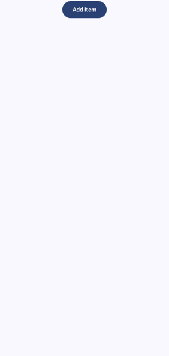
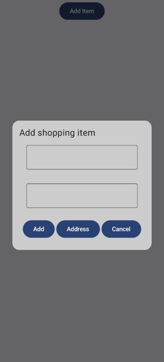
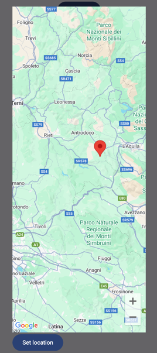
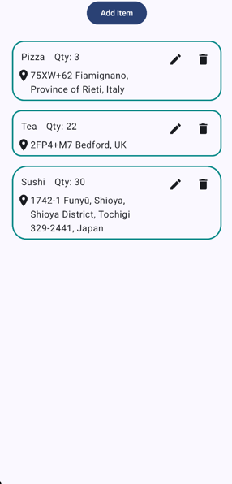

# ShoppingList

### Simple android shopping list app with temporary memory and ability to select location on map

## Used technologies and tools

- Kotlin
- Android SDK
- Jetpack Compose
- Mutable States
- ViewModel
- Gson
- Retrofit
- GoogleMaps API

*This project was developed as part of The Complete Android 14 & Kotlin Development Masterclass by TutorialsEU*

*Minimum supported Android version is **Android 7 (Nougat)***

### Start screen

### Adding new shopping item

### Setting location

### Ready shopping list

